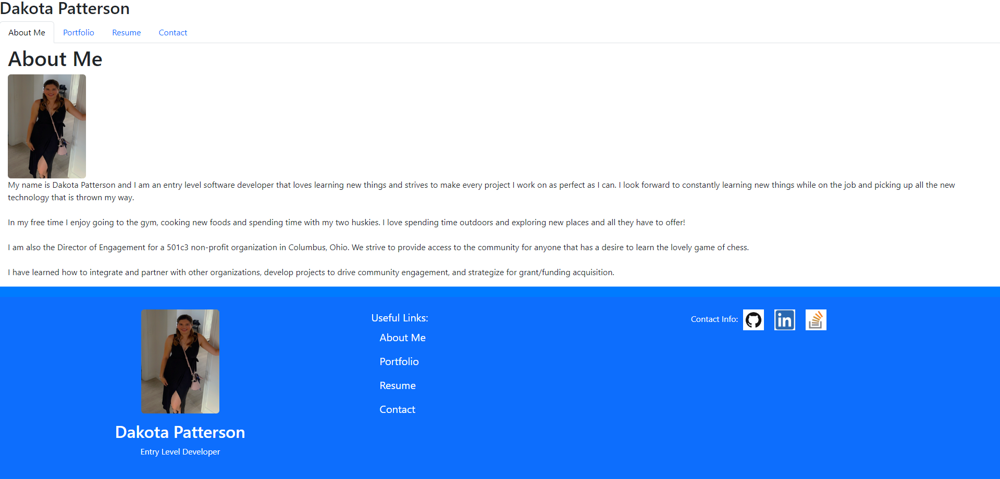

# react-portfolio

  ## Description
  This project is a portfolio that uses React to display a single page application. My motivation was to make an application that allowed users to look through my portfolio and be able to see work that I have deployed and have a way to contact me. This application allows the user to click on links to my work and view the launched sites and also to download my resume directly. I have learned that using React to create single page applications is a great way to stay organized and have clean and well structured websites.

  ## Table of Contents
- [Usage](#usage)
- [Contribution](#contribution)
- [Tests](#tests)
- [License](#license)
- [Questions](#questions)

## Usage

The best way to use this application is to go to the launched URL and view the pages of the website and test all the functions like the message fields and the download option for the resume.

## Contribution

Used the example code, html and css files provided by the OSU coding bootcamp.

https://git.bootcampcontent.com/Ohio-State-University/OSU-VIRT-FSF-PT-01-2024-U-LOLC

Used the react Bootstrap Docs: https://react-bootstrap.github.io/. 

Used this example for React Footers: https://medium.com/@racosta323/create-a-simple-footer-using-react-bootstrap-58c4371a4ade.

Used this for the contact form: https://mailtrap.io/blog/react-contact-form/

## Tests

This can be tested by going to the launched URL and checking all functions work as they should!

https://dakotapattersonportfolio.netlify.app

## License
This project is licensed under the [MIT License](https://opensource.org/licenses/MIT).

## Questions
For any questions, please contact [DakotaPatterson](https://github.com/kk) or email dakota.patterson19@yahoo.com.